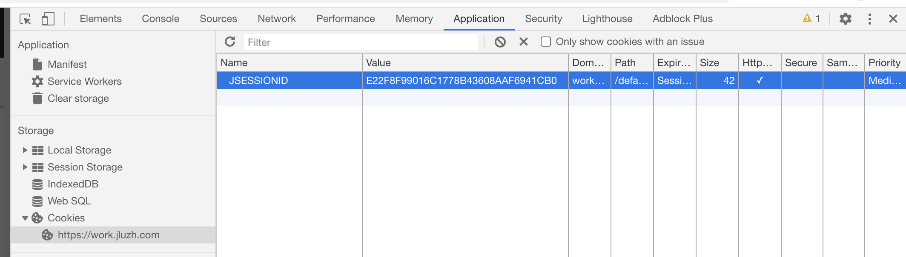

# Automatic-Health-Card

自动填写学校的健康卡，本项目仅用于学习和交流。

## 下载

`git clone https://github.com/JLUZHAnalytica/Automatic-Health-Card.git`

`cd Automatic-Health-Card`

## 本地如何使用

### 验证你的身份（手动法）

在浏览器打开 https://work.jluzh.com/default/work/jlzh/jkxxtb/jkxxcj.jsp 并登陆

登陆成功后打开浏览器的开发者工具，在如下图所示的位置找到 JSESSIONID，并复制到 setting.py 里面对应的位置

程序启动后，询问是否自动打开浏览器获取时，选择不打开，将自动从 setting.py 中读取。

### 启动程序

`python auto_health.py`

如果只想填写一个人的健康卡，填写范围时逗号两边一样即可。

**请谨慎填写学号范围！！！**

## Web版本